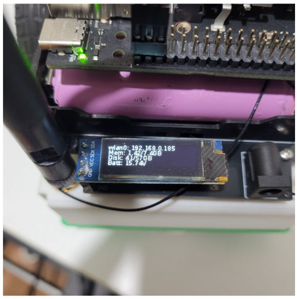
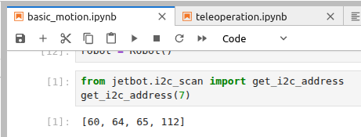

# JetBot Orin

## Introduction

<!--[](https://discord.gg/Ady6NtF) -->

This is a Jetbot that has been modified from an existing Jetson Nano to use the Jetson Orin Nano. It was built for Waveshare's Jetbot.

## Getting Hardware

- [NVIDIA Jetson Orin Nano Super Developer Kit](https://www.amazon.com/NVIDIA-Jetson-Orin-Nano-Developer/dp/B0BZJTQ5YP/ref=sr_1_1?dib=eyJ2IjoiMSJ9.EY0iLDd0M9dkGkWsLUJY8AUMTKs63_fI_v1UtmDOFxCeIl6JgEjjfAzyvqkCtigD7GjQMqsx074mMj8kSaZW_6Fj56fSmmgrnWik3WiLiXBr7x_bqMdkXBhnoOK_fu6dZd-kVM8TydffGfB0vqHxEHuwDn0qiuNJn6vQ4-J2dDQYL9rd4edsv-f9A_qWu-zdjw1NzzS1xLTQBuP4qjMuVOa0tHsoaFlhqDk7gdnuLNI.EwUOl1wWJ_QEa3xWEl_QypZzTs2enqerw7Sv1JCuMVY&dib_tag=se&keywords=nvidia%2Bjetson%2Borin&qid=1776615465&sr=8-1&th=1)

- [Jetbot Orin Kit](https://test-bed-robot-for-ai.myshopify.com/products/jetbot-orin?variant=53153578844525).

## JetPack Version

This code is tested on JetPack 6.2 / R36 (release) / REVISION: 4.4 version.

## Installation Package

```
git clone https://github.com/kimbring2/jetbot.git -b jetbot-orin
```

```
cd jetbot
```

```
sudo python3 setup.py install
```

```
sudo apt-get install python3-setuptools
sudo apt-get install python3.10-venv
sudo apt update && sudo apt install python3-pip
python3 -m pip install jupyterlab
pip install Adafruit_GPIO
```

## Register Service

```
cd jetbot/utils
```

```
python create_jupyter_service.py
python create_stats_service.py
```

```
sudo cp jetbot_stats.service /etc/systemd/system/
sudo cp jetbot_jupyter.service /etc/systemd/system/
```

```
sudo chown root:root /etc/systemd/system/jetbot_stats.service
sudo chown root:root /etc/systemd/system/jetbot_jupyter.service

sudo chmod 644 /etc/systemd/system/jetbot_stats.service
sudo chmod 644 /etc/systemd/system/jetbot_jupyter.service
```

```
sudo systemctl daemon-reload

sudo systemctl enable jetbot_stats.service
sudo systemctl enable jetbot_jupyter.service

sudo systemctl start jetbot_stats.service
sudo systemctl start jetbot_jupyter.service

sudo reboot
```

## Checking you did every setting correctly

After registering services above, you can see the Jetbot's current status from OLED display.



Unlike original Jetbot, it shows the current battery charging status. Please make sure it should be over 14V. Otherwise, you neet to charge the Jetbot.

You can connect the Jetbot throguh Juputer Lab through IP assigned to Jetbot. You should set the IP address via Desktop GUI if you have never used it before or when registering a new WiFi. Once connected to WiFi, Jetbot will automatically connect to that IP when turned on.


## 

## Verifying I2C Sensor on PCB

After connecting to Jupter Lab of Jetbot, please run cell of `basic_motion` Notebook.



You should see the same result above. Otherwise, there is some problem in your setting.

## Enable Dual CSI Camera

Jetbot Orin version uses two CSI cameras instead of the existing single CSI camera.

1. **Open Terminal** and run:
   
   bash
   
   ```
   sudo /opt/nvidia/jetson-io/jetson-io.py
   ```

2. Select **Configure Jetson CSI camera slot(s)**.

3. Select the camera type (e.g., `imx219 dual` for Waveshare Binocular camera).

4. Save the changes and select **Reboot** to apply settings. 

## Installing OpenCV with Gstreamer

To use CSI camera with OpenCV, you must follow the build method of [this Medium post link](https://medium.com/@erencanbulut/step-by-step-build-opencv-with-gstreamer-on-jetson-orin-nano-ubuntu-22-04-08edfb373c78).
